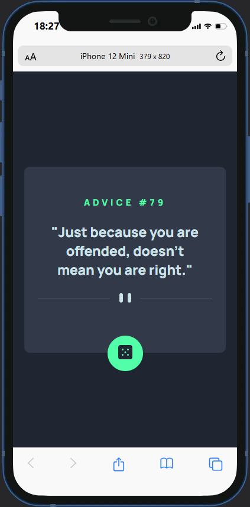
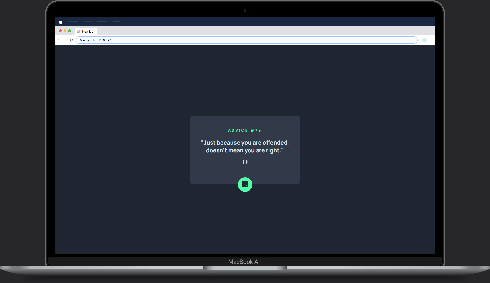

# Frontend Mentor - Solução do app Gerador de Conselhos

Esta é uma solução para o desafio do [App Gerador de Conselhos no Frontend Mentor](https://www.frontendmentor.io/challenges/advice-generator-app-QdUG-13db). Os desafios do Frontend Mentor ajudam você a melhorar suas habilidades de codificação criando projetos realistas.

## Índice

- [Visão geral](#visão-geral)
  - [O desafio](#o-desafio)
  - [Captura de tela](#captura-de-tela)
  - [Links](#links)
- [Meu processo](#meu-processo)
  - [Tecnologias utilizadas](#tecnologias-utilizadas)
  - [O que aprendi](#o-que-aprendi)
  - [Recursos úteis](#recursos-úteis)
- [Autor](#autor)
- [Agradecimentos](#agradecimentos)

---

## Visão geral

### O desafio

O objetivo do projeto é permitir que o usuário:

- Visualize o layout otimizado para o app dependendo do tamanho da tela do dispositivo.
- Veja o estado de hover para todos os elementos interativos na página.
- Gere um novo conselho ao clicar no ícone de dado.

### Captura de tela

- Versão Mobile: 
- Versão Desktop: 

### Links

- URL da solução: [Repositório GitHub](https://github.com/Vanderlei94/app-gerador-de-conselhos)
- URL do site ao vivo: [GitHub Pages](https://vanderlei94.github.io/app-gerador-de-conselhos/)

---

## Meu processo

### Tecnologias utilizadas

- HTML5
- CSS (Flexbox e Propriedades Personalizadas)
- JavaScript (usando a Fetch API para requisições)
- Design Responsivo (abordagem mobile-first), mas por ser um projeto simples, apenas aplicado diretamente no HTML, sem necessidade de Media Queries.

### O que aprendi

Este projeto foi uma excelente oportunidade para aprender mais sobre como integrar APIs de terceiros com JavaScript. Aqui estão alguns dos principais aprendizados:

- **Trabalhando com APIs**: Aprendi a usar o `fetch()` para fazer requisições HTTP e lidar com respostas em JSON. A integração com a API [Advice Slip API](https://api.adviceslip.com/advice) foi uma experiência de aprendizado muito interessante.

  Exemplo de como lidar com respostas da API:
  ```javascript
  const response = await fetch("https://api.adviceslip.com/advice");
  const adviceContent = await response.json();
  const adviceId = `Advice #${adviceContent.slip.id}`;
  const adviceText = `"${adviceContent.slip.advice}"`;
  ```

- **Manipulação do DOM**: Melhorei minhas habilidades em manipular o DOM de forma dinâmica, atualizando os elementos da página com os dados recebidos da API.

  Exemplo de como atualizar a página dinamicamente:
  ```javascript
  adviceNumber.innerText = adviceId;
  adviceDescription.innerText = adviceText;
  ```

- **Tratamento de erros**: Implementar os blocos `try-catch` me ajudou a gerenciar erros potenciais durante a requisição da API (por exemplo, problemas de rede).

### Recursos úteis

- [MDN Web Docs - Fetch API](https://developer.mozilla.org/en-US/docs/Web/API/Fetch_API) - Este recurso me ajudou a entender como trabalhar com a Fetch API.
- [JavaScript.info - Fetch](https://javascript.info/fetch) - Um tutorial excelente que me ajudou a entender melhor o código assíncrono e como usá-lo.
- [Frontend Mentor](https://www.frontendmentor.io/) - Uma plataforma incrível para praticar habilidades de front-end com desafios reais.

---

## Autor

- **Portfólio** - [Vanderlei Junior](https://vanderlei94.github.io/portfolio/)
- **Email** - [vanderleicas@icloud.com](mailto:vanderleicas@icloud.com)
- **LinkedIn** - [Vanderlei Junior](https://www.linkedin.com/in/vanderleidev/)
- **GitHub** - [Vanderlei94](https://github.com/Vanderlei94)
---

## Agradecimentos

- Agradecimentos ao pessoal do [DevQuest](https://www.linkedin.com/school/devquest-dev-em-dobro/?originalSubdomain=br) pelo curso que tem sido muito importante no meu aprendizado e desenvolvimento.
- Agradecimentos ao [Frontend Mentor](https://www.frontendmentor.io/) pelo desafio.
- Um agradecimento especial a todos os recursos e tutoriais online que me ajudaram a concluir este projeto!